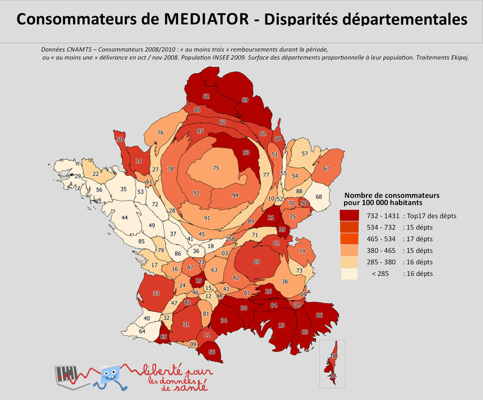
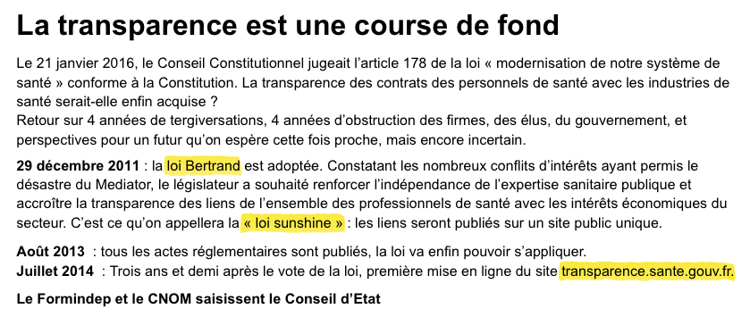

### L’ouverture des données de santé&nbsp;: une entrée par les acteurs

Journée d’études «&nbsp;[Chiffres privés, chiffres publics](https://chiffres.hypotheses.org)&nbsp;», 31 mai 2017

Session «&nbsp;Co-production de chiffres publics&nbsp;»

---

### Deux cas d'étude

1. ___Sunshine_ – Faire la «&nbsp;transparence&nbsp;» sur les revenus des médecins__ pour reconfigurer un espace socio-économique

2. ___Épidemium_ – Travailler sur les _open data_ relatives au cancer__ dans un «&nbsp;laboratoire collaboratif ouvert&nbsp;»&nbsp;: un dispositif-frontière

---

### Des chiffres à la *data*

Passage des notions de&nbsp;:

- Chiffres &rarr; *data*
- Calcul &rarr; méthodes algorithmiques

Méthodes statistiques complétées par&nbsp;: fouille de données (*data mining*), classification (*clustering*), apprentissage (non) supervisé (*machine learning*), …

+++

*[Site de la Société Française de Statistique-17-05-29](https://www.sfds.asso.fr/)*

---

### Des chiffres à la *data*

Passage des qualificatifs de&nbsp;:  

- Publics/ privés &rarr; *open*, données ouvertes, d'intérêt général, sensibles, personnelles
- Mais aussi&nbsp; *big data*, *smart data*, «&nbsp;données utiles&nbsp;», ...

+++

*[Site data.gouv.fr-17-05-29](http://www.data.gouv.fr/fr/)*

+++

*[Site Roche-17-05-29](http://www.roche.fr/innovation-recherche-medicale/big-data-sante.html)*

---

### Imaginaire numérique et *data*

**Horizons d’attentes** fortes autour de ce «&nbsp;monde des données&nbsp;» d’un point de vue&nbsp;:

- **Économique, social, scientifique, politique** dans de nombreux domaines (effet «&nbsp;pervasif&nbsp;» du numérique) ; *(Boullier, 2016) *
- associés à un imaginaire numérique&nbsp;: **idéal du partage, de la transparence, de la collaboration.** *(Gruson-Daniel et al., 2016;  Ibekwe-Sanjuan et al., 2015; Turner, 2012)*

+++

*[CC-BY-ND-Epidemium](http://www.epidemium.cc/white-paper-fr/index.html)*

+++

 *[CC-BY-ND-Epidemium](http://www.epidemium.cc/white-paper-fr/index.html)*

---

### Imaginaire numérique et *data*

*Open Big Data*&nbsp;: **une formule** (Krieg-Planque, 2009) employée par tous mais des **significations multiples** qui révèlent différents **enjeux et intérêts**&nbsp;:

  - *Big data*&nbsp;: maitrise technique, enjeux économiques, avantages compétitifs ;
  - *open data*&nbsp;: enjeu gestionnaire, économique, démocratique.

+++

*[Infographie Roche&nbsp;: La Big Data au coeur de la santé](http://www.roche.fr/innovation-recherche-medicale/big-data-sante/infographie.html)*

### L’*open data* en santé

**Une mise à disposition de données publiques dans la mouvance  «&nbsp;*open government*»&nbsp;»**

- **Loi République Numérique - 7 octobre 2017**&nbsp;: vient achever long parcours juridique (notion de **données d’intérêt général**, mission de service public de la donnée, droit à l’*open data* à la suite de la loi CADA).

+++

[Loi pour une République Numérique - 16-10-07 ](https://www.legifrance.gouv.fr/affichLoiPubliee.do?idDocument=JORFDOLE000031589829&type=general&legislature=14)

+++

[Site CADA.fr](http://www.cada.fr/)

+++

**Une mise à disposition de données publiques dans la mouvance  «&nbsp;*open government*»&nbsp;»**

*Open data*&nbsp;: continuum entre régime de performance et régime démocratique&nbsp;: (Ogien, 2010)
  - Dans la lignée de la **«&nbsp;modernisation&nbsp;»** de l’État (productivié, efficacité) ;
  - injonction forte d’accès et de transparence mais aussi de participation  ==>  **«&nbsp;simplification&nbsp;»** pour mieux faire circuler.

---

### L’open data en santé&nbsp;: quelles significations&nbsp;?

Définition de l’*open data* dans le domaine de la santé, en pratique&nbsp;:

- Dans le contexte de la loi, que peut-on définir comme données d’intérêt général (social, économique et environnemental)&nbsp;?

- partage restreint des données sanitaires issues des institutions publiques et privées hospitalières et de santé ⇒ création de l’[Institut des Données de Santé](http://www.institut-des-donnees-de-sante.fr/)

+++

Mais ouverture d'autres données revendiquée&nbsp;:

l’exemple d'[Opentrials](https://opentrials.net/)

[Vidéo présentation Opentrials](https://opentrials.net/)

+++

On peut rajouter aussi les données du **«&nbsp;soi quantifié&nbsp;»** issues des applis *e-santé/m-mobile*.

[Cahier prospectif&nbsp;: le corps, nouvel objet connecté - CNIL]( https://www.cnil.fr/sites/default/files/typo/document/CNIL_CAHIERS_IP2_WEB.pdf)

+++

Que signifie chiffres privés/publics dans ce contexte&nbsp;? Qu'entendre par «&nbsp;ouvrir des données&nbsp;»&nbsp;? Quels rôles pour de nouveaux acteurs dans ce domaine (régulateurs, détenteurs de données sur Internet, etc.)&nbsp;?

---

### Cas d’étude 1&nbsp;: «&nbsp;ouvrir&nbsp;» des données de santé

SNIIRAM (assurance-maladie), PMSI (hôpitaux), tarifs médicaux, essais cliniques, prescriptions…

Des données privées difficiles à «&nbsp;ouvrir&nbsp;»&nbsp;:

<!--problème côté demande -->
<!-- ... surtout si les données sont longitudinales -->

<!--problème côté offre : valeur compétitive intrinsèque -->
<!-- ... y compris pour les agences publiques ! -->

- __Risque de réidentification__ des consommateurs
- __Valeur commerciale__ pour les producteurs

---

### L’accès aux données dans les agences publiques

Un __régime d'accès fragmenté__ en miroir de la gouvernance du système de santé&nbsp;:
<!-- régime bismarckien universalisé -->

<!-- HAS = ex-ANAES, ANSM = ex-AFSSAPS, ARS = HPST (préfig. Juppé) -->
- Accès «&nbsp;__État__&nbsp;» (DGS, HAS, ANSM, ARS, CEPS…) 
  ≠ Accès «&nbsp;__Assurance-maladie__&nbsp;» (CNAM, URCAM) 
  ≠ Accès «&nbsp;__Ordre__&nbsp;» (CNOM, sociétés)
- Autorisations requises : CADA et CNIL (CCTIRS, IDS)
<!-- CCTIRS = Comité consultatif sur le traitement de l’information en matière de recherche dans le domaine de la santé -->

---

### L’accès aux données dans l’industrie sanitaire

Un __système de collecte parallèle__ à celui de l’État&nbsp;:
<!-- i.e. du service public -->

- Démarchage des __cabinets médicaux__ (et des pharmacies)
- Contractualisation avec les __professionnels__
- Demandes CADA auprès des __agences sanitaires__

<!-- ... et aussi : scraping du site CNAMTS (Ameli) ! -->
<!-- Pierre-Louis Bras (IGAS), rapp. gouvernance et utilisation des données de santé, 2013 : les industries n'ont pas besoin des données, elles les ont déjà ! -->

---

### Ouvrir une «&nbsp;donnée&nbsp;» sensible

Comment faire la transparence sur les  
__revenus des professionnels de santé__&nbsp;?

- Sources publiques&nbsp;: __rapports IGAS, DREES, HCAAM__
- Sources privées&nbsp;: __déclarations des laboratoires__

---

Fichier «&nbsp;Sunshine 2013&nbsp;» du laboratoire Lundbeck

---

### Les motivations des acteurs

Pour les __acteurs publics__&nbsp;:

<!-- évitement du blâme : éviter les scandales -->
- Améliorer la sécurité sanitaire
- Limiter les conflits d'intérêt
<!-- médecins/pharma, mais aussi : présidence HAS, Cahuzac Conseil, collusions autour des AMM ou de la fixation des prix des médicaments -->

Pour les __acteurs privés__&nbsp;:

- __Industriels installés__&nbsp;: préserver la rentabilité
- __Nouveaux entrants__&nbsp;: provoquer un choc d'offre
- __Société civile__&nbsp;: conscientiser l’activité médicale
<!-- càd. rendre les sur-prescriptions et/ou les conflits d'intérêts apparents, à des fins de dénonciation : naming/shaming ; idem revenus des députés et dépenses IRFM (Indemnité représentative de frais de mandat) -->

---

### Les stratégies déployées

- Faire __pression en public__
- Faire __pression en privé__
- Rendre les données ___lisibles___

---

<a href="https://web.archive.org/web/20140310125109/http://www.opendatasante.com/">Initiative Transparence Santé</a>, 2013
<!-- obj. affiché n°1 : rationaliser les dépenses -->

---

<a href="https://web.archive.org/web/20140310125109/http://www.opendatasante.com/">Initiative Transparence Santé</a>, 2014
<!-- objectif affiché n°2 : éviter les accidents sanitaires (Servier reprend l'argument dans sa procédure) -->

<!--https://www.data.gouv.fr/fr/reuses/cartogramme-des-consommateurs-de-mediator-en-france/ -->

---

<a href="https://www.transparence.sante.gouv.fr/">Base Transparence Santé</a> (2014)

---

<a href="http://www.formindep.org/La-transparence-est-une-course-de.html">Actions du Formindep</a> (2016)

---

Regards Citoyens&nbsp;: <a href="https://www.regardscitoyens.org/sunshine/">Projet «&nbsp;Sunshine&nbsp;»</a> (2015)

---

---

### Cas d’étude 2&nbsp;: *open data* en épidémiologie du cancer&nbsp;: le projet de recherche Epidemium

[Page d'accueil d'Epidemium-17-05-29](http://www.epidemium.cc)

---

#### 1/ Un renouvellement des rhétoriques de la promesse

[Communiqué de presse Epidemium- Juillet 2015](http://www.epidemium.cc/images/Communiqu%C3%A9%20Roche%20La%20Paillasse%20du%2006.07.15%20Lancement%20Epidemium.pdf)

+++

#### 1/ Un renouvellement des rhétoriques de la promesse  

*Open big data*&nbsp;: une nouvelle **rhétorique de la promesse** à la fois scientifique, médicale et économique employée dans le domaine de la santé (Dalgalarrondo et Hauray, 2015 ; Novas, 2006)  

==> une nécessité d'**articuler des acteurs aux intérêts divers** (progrès scientifique et thérapeutique, logique économique, etc.)

---

#### 2/ Epidemium&nbsp;: un dispositif frontière dans l’ouverture de données en santé

*[CC-BY-ND-Epidemium](http://www.epidemium.cc/white-paper-fr/index.html)*

+++

#### 2/ Epidemium&nbsp;: un dispositif frontière dans l’ouverture de données en santé

Dispositif frontière - un assemblage hétérogène regroupant à la fois&nbsp;:
- Des institutions privées, publiques ;
- la mise en place de normes, d'insfrastructures, d'un langage commmun (jeux d’ inter-médiations).

==> **co-production de la *data* et construction des modalités même de l’ouverture.**

---

#### 3/ Inter-médiations à l’œuvre&nbsp;: une co-construction double&nbsp;: celle de la donnée et des modalités de son ouverture.

Qu’entend-on par *open big data*&nbsp;? Une définition commune à trouver.

+++

#### Différentes conceptions de la *data*&nbsp;:

**Données personnelles** (pour le médecin), **données «&nbsp;à libérer** &nbsp;»(compte à rendre à la communauté), données à anonymiser ou à «&nbsp;fausser&nbsp;» **(*fake data*)**.
==> dépendantes de l’idée même d’ouverture et de ses enjeux ;

**Démystification du *big data* **&nbsp;: travail sur des petits jeux de données (*dataset*) ;

+++

#### Diverses conceptions de l’*open*&nbsp;:

D’un accès  «&nbsp;maitrisé&nbsp;»  à un libre accès - **gradient de l’ouverture**&nbsp;:

  - **Mise à disposition restreinte** avec une infrastructure sécurisée ( ex&nbsp;: INDS ) ;

  VS

  - **ouverture et réutilisation libre** en favorisant également l’accessibilité de ces données.

---

#### 3/ Inter-médiations à l’œuvre&nbsp;: une co-construction double&nbsp;: celle de la donnée et des modalités de son ouverture.

Quel **cadre socio-technique** pensé/imaginé pour l’ouverture des données&nbsp;?

+++

#### Modalités d'ouverture des données par&nbsp;:

- Processus de **régulation juridique**&nbsp;:  conformité avec la CNIL, protocole de simplification pour ouvrir les données.

- Processus **techniques** reposant sur des algorithmes&nbsp;: réponse aux attentes des différentes parties prenantes (qualité, sécurité... ) ex&nbsp;: notion de données synthétiques / *fake data*.

+++

#### Modalités d'ouverture des données, deux axes:

- D'un côté, **modalité «&nbsp;classique&nbsp;»** &nbsp;:  création d’instance de régulation, mise en place de protocole et de loi ;

- d’un autre côté, **basculement sur des solutions techniques** (algorithmiques) reposant sur un imaginaire cybernetico-numérique&nbsp;: suppression tiers de confiance, responsabilité  basculée sur les algorithmes, la «&nbsp;circulation&nbsp;» prime).

+++

#### Effet «&nbsp;meta&nbsp;» - ouverture des méthodes de travail&nbsp;:

Partage, transparence, travail collaboratif...

VS

**logiques gestionnaires**&nbsp;: mesure de l’efficacité et de la performance des équipes.

---

### Conclusion

Pour contribuer à cette journée&nbsp;:

- Chiffres privés/publics&nbsp;: distinction floue  ==> proposition d'une **grille de lecture par le degré d’ouverture** souhaité ;

- nouveaux acteurs et dispositifs frontières ==> des **recompositions** à la fois basées sur des **processus de compétition** mais aussi d'articulation/**coopération** ;

+++

##### Processus de co-construction de la donnée (de sa signification) mais aussi des modalités de son ouverture&nbsp;:

  - Construction d'un cadre socio-technique reposant de plus en plus sur un imaginaire cyber-numérique fort&nbsp;:

    - Une **légitimité par la maitrise de la technique**, de la «&nbsp;*data science*&nbsp;» ;
    - une **responsabilité re-portée sur la technique**.
---

### Merci de votre attention

- __François Briatte__&nbsp;:  European School of Political and Social Sciences, Université Catholique de Lille   [francois.briatte@univ-catholille.fr](mailto:francois.briatte@univ-catholille.fr )

- __Célya Gruson-Daniel__&nbsp;: Centre Virchow-Villermé de santé publique Paris-Berlin, Université de Technologie de Compiègne (Costech), Université de Laval-Québec (LabCMO)   [celya.gruson-daniel@parisdescartes.fr](mailto:celya.gruson-daniel@parisdescartes.fr)

Présentation et bibliographie disponibles en ligne&nbsp;:  
[`gitpitch.com/celyagd/ODS`](https://gitpitch.com/celyagd/ODS)  
